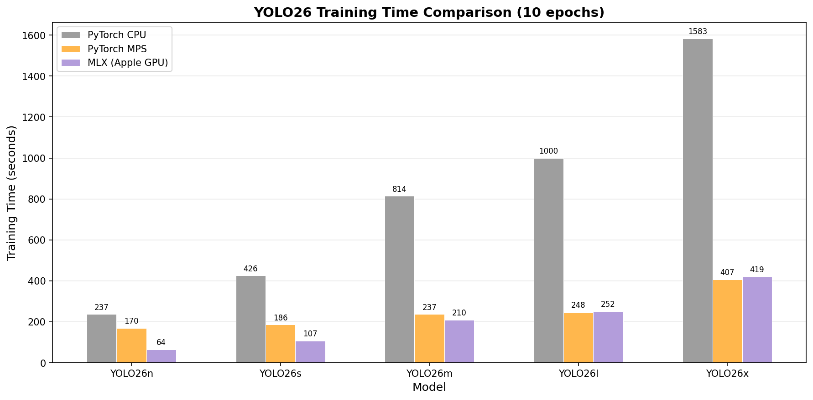

# YOLO26 MLX

[](LICENSE)
[](https://www.python.org)
[](https://github.com/ml-explore/mlx)
[](https://support.apple.com/en-us/116943)
[](https://github.com/thewebAI/yolo-mlx/actions/workflows/ci.yml)

Pure [MLX](https://github.com/ml-explore/mlx) implementation of YOLO26 for Apple Silicon. No PyTorch dependency at runtime.

YOLO26 is the latest generation of the [YOLO](https://docs.ultralytics.com/models/yolo26/) real-time object detection family by [Ultralytics](https://github.com/ultralytics/ultralytics), featuring NMS-free end-to-end detection and simplified DFL-free box regression. This project re-implements the full inference and training pipeline in Apple's [MLX](https://github.com/ml-explore/mlx) framework for native Metal GPU acceleration on Apple Silicon.

## Table of Contents

- [Highlights](#highlights)
- [Validation Results](#validation-results-coco-val2017-5000-images)
- [Performance](#performance)
- [Requirements](#requirements)
- [Project Structure](#project-structure)
- [Quick Start: Inference](#quick-start-inference)
- [Quick Start: Training](#quick-start-training)
- [Full Setup](#full-setup)
- [Inference Benchmarking](#inference-benchmarking)
- [COCO val2017 Validation](#coco-val2017-validation-map)
- [Training Benchmarking](#training-benchmarking)
- [Architecture](#architecture)
- [Contributing](#contributing)
- [License](#license)

## Highlights

- **Pure MLX** — 100% MLX at runtime, leverages Metal GPU acceleration via `mx.compile`
- **Apple Silicon Optimized** — Designed for M1/M2/M3/M4 chips
- **End-to-End Detection** — NMS-free detection with one-to-one matching
- **Full Training Pipeline** — MuSGD optimizer, EMA, warmup, LR scheduling
- **Official-Matching Accuracy** — COCO val2017 mAP with most models within 0.2% and a maximum deviation of 0.5%.

## Validation Results (COCO val2017, 5000 images)

| Model | MLX mAP50-95 | Official mAP50-95 | Gap | FPS |
|-------|-------------|-------------------|------|-----|
| yolo26n | **40.2%** | 40.1% | +0.1% | 170.6 |
| yolo26s | **47.6%** | 47.8% | -0.2% | 105.3 |
| yolo26m | **52.3%** | 52.5% | -0.2% | 54.6 |
| yolo26l | **53.9%** | 54.4% | -0.5% | 43.6 |
| yolo26x | **56.7%** | 56.9% | -0.2% | 24.3 |

## Performance

All benchmarks were run on an **Apple M4 Pro** with macOS 26.3.1 and Python 3.14.3. YOLO26 MLX delivers significant speedups over PyTorch on Apple Silicon. For inference, MLX is up to **2.07× faster** than PyTorch MPS (yolo26n: 170.6 vs 82.6 FPS) and up to **3.56× faster** than PyTorch CPU. For training (COCO128, 10 epochs), MLX is up to **2.65× faster** than MPS (yolo26n: 64.1s vs 169.8s) and up to **3.99× faster** than CPU. Smaller models benefit the most from MLX's Metal-optimized compute graph and `mx.compile` JIT, while larger models converge toward parity as the workload becomes compute-bound.


## Requirements

- macOS with Apple Silicon (M1/M2/M3/M4)
- Python 3.10+
- MLX 0.30.3+

## Project Structure

```
yolo-mlx/
├── src/yolo26mlx/                 # Core MLX package
│   ├── cfg/                       # Model and dataset YAML configs
│   ├── converters/                # PyTorch -> MLX weight converter
│   ├── data/                      # Data loading and dataset helpers
│   ├── engine/                    # YOLO, Predictor, Trainer, Validator, Results
│   ├── nn/                        # Network blocks and task/model builders
│   ├── optim/                     # MuSGD optimizer
│   └── utils/                     # Losses, ops, TAL, metrics, callbacks
├── scripts/                       # Benchmark/eval/download utilities
├── configs/                       # Dataset configs used by scripts
├── tests/                         # Unit/integration tests
├── GUIDE_INFERENCE_VALIDATION.md  # Inference + COCO validation guide
├── GUIDE_TRAINING_BENCHMARK.md    # Training benchmark guide
├── README.md
└── pyproject.toml

# Runtime folders (created by scripts when needed)
datasets/
images/
models/
results/
```

---

## Quick Start: Inference

Run object detection on an image in under 5 minutes.

```bash
# 1. Setup
cd yolo-mlx
python3 -m venv .venv && source .venv/bin/activate
pip install -e .
pip install -e ".[convert]"

# 2. Download a pretrained model and convert to MLX format
bash scripts/download_yolo26_models.sh          # downloads all .pt weights to models/
yolo26 converters convert models/yolo26n.pt -o models/yolo26n.npz --verify

# 3. Run inference
mkdir -p images
curl -L -o images/bus.jpg https://ultralytics.com/images/bus.jpg
```

```python
from yolo26mlx import YOLO

model = YOLO("models/yolo26n.npz")
results = model.predict("images/bus.jpg", conf=0.25)
print(results[0])                    # detection summary
results[0].save()                    # saves labeled image to results/
```

The `predict()` method accepts a file path, directory, PIL Image, or numpy array.
Key parameters: `conf` (confidence threshold, default 0.25), `imgsz` (input size, default 640), `save` (auto-save results).

---

## Quick Start: Training

Fine-tune a YOLO26 model on your own data.

```bash
# 1. Setup (if not done already)
cd yolo-mlx
python3 -m venv .venv && source .venv/bin/activate
pip install -e .
pip install -e ".[convert]"

# 2. Download and convert a pretrained model as starting weights
bash scripts/download_yolo26_models.sh
yolo26 converters convert models/yolo26n.pt -o models/yolo26n.npz --verify
```

```python
from yolo26mlx import YOLO

# Load pretrained MLX weights
model = YOLO("models/yolo26n.npz")

# Train on COCO128 (auto-downloaded, ~7 MB, 128 images)
results = model.train(
    data="coco128",       # dataset name or path to data YAML
    epochs=10,
    batch=4,
    imgsz=640,
    project="runs/train",
    name="my_experiment",
)
```

To train on a custom dataset, create a YAML config following the COCO format
(see `configs/coco.yaml` for reference) and pass its path as `data`.
Key parameters: `epochs` (default 100), `batch` (default 16), `imgsz` (default 640),
`patience` (early stopping, default 50), `save_period` (checkpoint interval, -1 to disable).

See [GUIDE_TRAINING_BENCHMARK.md](GUIDE_TRAINING_BENCHMARK.md) for detailed training and benchmarking workflows.

---

## Full Setup

```bash
cd yolo-mlx

# Create and activate virtual environment
python3 -m venv .venv
source .venv/bin/activate

# Install the package
pip install -e .

# Install conversion dependencies (required to convert .pt → .npz weights)
pip install -e ".[convert]"

# Install COCO evaluation and chart generation tools
pip install pycocotools matplotlib
```

For PyTorch MPS/CPU comparison benchmarks, see [GUIDE_INFERENCE_VALIDATION.md](GUIDE_INFERENCE_VALIDATION.md) and [GUIDE_TRAINING_BENCHMARK.md](GUIDE_TRAINING_BENCHMARK.md).

Runtime directories (`datasets/`, `images/`, `models/`, `results/`) are created
automatically by the scripts and evaluation tools when needed.

---

## Inference Benchmarking

Measures MLX inference latency and throughput.

```bash
# All models
python scripts/benchmark_yolo26_inference.py --skip-mps --skip-cpu

# Specific models only
python scripts/benchmark_yolo26_inference.py --models n s --skip-mps --skip-cpu

# More timed runs for stable results
python scripts/benchmark_yolo26_inference.py --runs 20 --skip-mps --skip-cpu
```

**Output:** `results/yolo26_inference_three_way.json` (override with `--output path.json`)

| Metric | Description |
|--------|-------------|
| End-to-end latency (ms) | Full predict including pre/post processing |
| Forward-pass-only (ms) | Model inference only |
| FPS | Throughput (1000 / mean_ms) |
| Peak memory (MB) | MLX Metal memory usage |

The benchmark script also supports PyTorch MPS and CPU backends for comparison. See [GUIDE_INFERENCE_VALIDATION.md](GUIDE_INFERENCE_VALIDATION.md) for full multi-backend benchmarking instructions.

**Defaults:** 3 warmup runs, 10 timed runs, 640×640 image size


---

## COCO val2017 Validation (mAP)

Evaluates accuracy on the full COCO val2017 set (5,000 images) using official pycocotools.

### Setup COCO Dataset

```bash
# Automatic download script
bash scripts/download_coco_val2017.sh datasets/coco

# Or manually:
mkdir -p datasets/coco/images datasets/coco/annotations datasets/coco/labels

curl -L -o datasets/coco/images/val2017.zip http://images.cocodataset.org/zips/val2017.zip
unzip datasets/coco/images/val2017.zip -d datasets/coco/images/
rm datasets/coco/images/val2017.zip

curl -L -o datasets/coco/annotations/annotations_trainval2017.zip http://images.cocodataset.org/annotations/annotations_trainval2017.zip
unzip datasets/coco/annotations/annotations_trainval2017.zip -d datasets/coco/
rm datasets/coco/annotations/annotations_trainval2017.zip

curl -L -o datasets/coco/labels/val2017.zip https://github.com/ultralytics/assets/releases/download/v0.0.0/coco2017labels-segments.zip
unzip datasets/coco/labels/val2017.zip -d datasets/coco/
rm datasets/coco/labels/val2017.zip
```

### Run Validation

```bash
# Single model
python scripts/evaluate_coco_val.py --model yolo26n --data datasets/coco

# All 5 models
python scripts/evaluate_coco_val.py --model all --data datasets/coco

# Quick sanity check (100 images)
python scripts/evaluate_coco_val.py --model yolo26n --data datasets/coco --subset 100

# Custom thresholds
python scripts/evaluate_coco_val.py --model yolo26n --data datasets/coco --conf 0.001 --iou 0.7
```

**Output:** `results/` directory (override with `--output dir/`)

| Metric | Description |
|--------|-------------|
| mAP@0.5:0.95 | Primary COCO metric |
| mAP@0.5 | AP at IoU=0.50 |
| mAP@0.75 | AP at IoU=0.75 |
| mAP (small/medium/large) | AP by object size |

**Defaults:** conf=0.001, IoU=0.7, max_det=300, imgsz=640, batch=16 (all overridable via CLI flags)

---

## Training Benchmarking

COCO128 dataset (~7 MB, 128 images) is downloaded automatically on first run.

```bash
# All models
python scripts/benchmark_yolo26_training_mlx.py

# Specific models with custom settings
python scripts/benchmark_yolo26_training_mlx.py --models n s --epochs 10 --batch 4
```

**Output:** `results/yolo26_mlx_training_final.json` (override with `--output path.json`)

| Metric | Description |
|--------|-------------|
| Training time (s) | Total wall-clock time |
| Time/epoch (s) | Average per epoch |
| Final loss | End-of-training loss |
| mAP@0.5 | Post-training accuracy |
| Peak memory (MB) | Metal peak memory |

**Training defaults:** 10 epochs, batch=4, COCO128 dataset, lr=0.000119 (MuSGD auto). All overridable via `--epochs`, `--batch`, `--lr`, `--output`.

For PyTorch MPS/CPU training benchmarks and chart generation, see [GUIDE_TRAINING_BENCHMARK.md](GUIDE_TRAINING_BENCHMARK.md).



---

## Architecture

YOLO26 introduces:

- **DFL Removal** — Eliminates Distribution Focal Loss for simpler export and broader edge compatibility
- **End-to-End Detection** — NMS-free inference using one-to-one matching, producing predictions directly without post-processing
- **Simplified Box Regression** — `reg_max=1` removes DFL bins entirely
- **ProgLoss + STAL** — Improved loss functions with notable gains on small-object detection
- **MuSGD Optimizer** — Hybrid of SGD and Muon (Newton-Schulz orthogonalization) with auto LR, inspired by advances in LLM training

## Contributing

Contributions are welcome! Please see [CONTRIBUTING.md](CONTRIBUTING.md) for guidelines.

## License

This project is licensed under the [GNU Affero General Public License v3.0 (AGPL-3.0)](LICENSE).

This project utilizes code from Ultralytics YOLO26 (https://github.com/ultralytics/ultralytics), modified in 2026.

See the [LICENSE](LICENSE) file for the full license text.
